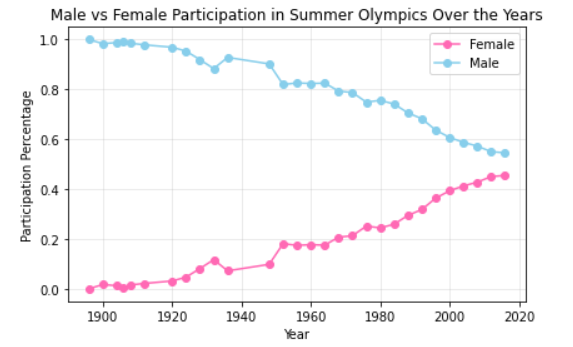
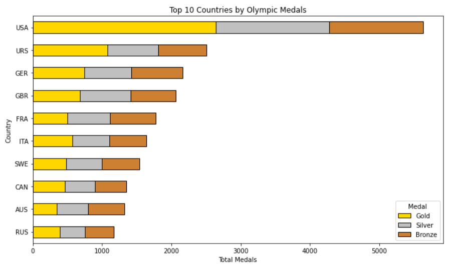

Explore 120 years of Olympic Games data to uncover athlete and country performance trends.

🏅 Olympics Data Analysis with Python

Jupyter Notebook: notebook/Olympics.ipynb

  This project performs exploratory data analysis (EDA) on historical Olympic Games data using Python. The goal is to uncover patterns, trends, and insights about athletes, countries, and sports through data wrangling and interactive visualizations.

📚 Dataset

  Source: Kaggle – [120 Years of Olympic History](https://www.kaggle.com/datasets/heesoo37/120-years-of-olympic-history-athletes-and-results)


📌 Objective

  Analyze Olympic data to discover trends in:
  
  Medal counts by country and sport

  Athlete demographics (age, gender, nationality)

  Gender participation over time

  Top-performing athletes and countries

🧰 Tech Stack :  Python, Pandas, NumPy, Matplotlib, Seaborn, Plotly, Jupyter Notebooks, HTML (for report export)

📈 Key Features

  ✅ Data cleaning and preprocessing

  🥇 Country-wise and sport-wise medal analysis

  🚻 Gender participation trends over time

  🏆 Top-performing athletes and countries

  📊 Interactive visualizations with Seaborn & Plotly

  📄 HTML report generation (Olympics.html)

📁 Project Structure
 ```
olympics-data-analysis/
├── data/                # Raw and cleaned datasets
├── notebooks/           # Jupyter notebooks for EDA
├── visualizations/      # Generated charts and plots
├── README.md            # Project overview
└── requirements.txt     # Python dependencies
 ```

📊 Sample Insights

Male vs Female Participation over the years




“USA has the highest total medal count”




